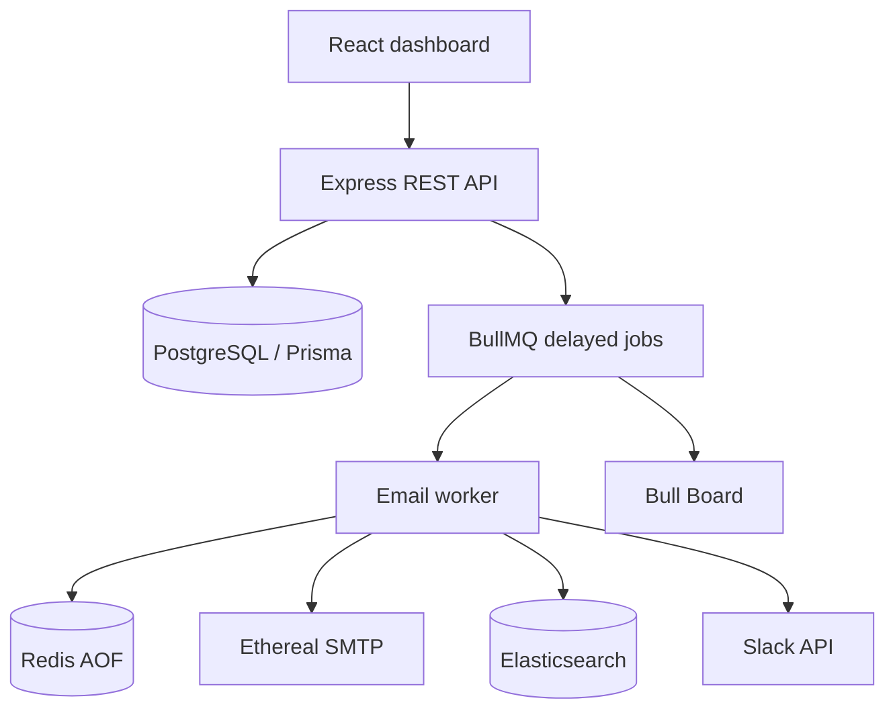

# Email Scheduler

A production-style email scheduling monorepo built around PostgreSQL, Redis, BullMQ, Ethereal SMTP, Elasticsearch, Google OAuth, Slack OAuth, and a React dashboard.

## Architecture



The API persists each recipient as its own `EmailJob`. Its deterministic BullMQ id is based on the campaign and recipient position. The worker atomically claims a database row before sending, so duplicate delivery after retries or restarts is suppressed. Delays are stored in both Postgres and BullMQ; Redis uses AOF persistence in Docker.

## Requirements

- Node.js 20+
- npm 10+
- Docker Desktop with Compose
- Google OAuth credentials
- Slack OAuth credentials
- Ethereal SMTP credentials

Node/npm were not available in the authoring environment, so install dependencies and run the checks locally after installing Node.

## Setup

```powershell
docker compose up -d
npm install
Copy-Item backend/.env.example backend/.env
Copy-Item frontend/.env.example frontend/.env
npm --prefix backend install
npm --prefix frontend install
npm --prefix backend exec prisma generate
npm --prefix backend exec prisma migrate dev --name init
```

Fill `backend/.env` with OAuth, SMTP, and JWT values. Never commit either `.env` file. Google callback is `http://localhost:4000/api/auth/google/callback`; Slack callback is `http://localhost:4000/api/slack/callback`.

Run each process in its own terminal:

```powershell
npm --prefix backend run dev
npm --prefix backend run worker
npm --prefix frontend run dev
```

Open `http://localhost:5173`. The authenticated API is at `http://localhost:4000`. Bull Board is at `http://localhost:4000/admin/queues` and requires the same session cookie.

## Sender setup

Sender credentials are intentionally never returned by the API. Create a sender once after Google login using the API, replacing the values with an Ethereal account:

```powershell
Invoke-RestMethod -Method Post http://localhost:4000/api/senders `
  -ContentType 'application/json' `
  -WebSession $session `
  -Body '{"email":"test@example.com","name":"Test Sender","etherealUsername":"...","etherealPassword":"..."}'
```

In a browser, use the dashboard session and a REST client that preserves cookies. The compose screen then lists the sender.

## Features

- Google OAuth login with secure, HTTP-only JWT cookie.
- User-owned senders, campaigns, and email jobs.
- CSV parsing with validation, invalid-address reporting, and duplicate removal.
- BullMQ delayed scheduling with configurable worker concurrency and exponential SMTP retries.
- Atomic idempotency claim (`scheduled`/`delayed` to `processing`) before SMTP delivery.
- Redis sender/hour counters shared across workers and instances.
- Rate-limited jobs move to the next hour and emit one Slack notification per sender/window.
- Elasticsearch indexing and user-scoped search.
- Bull Board monitoring.
- Postgres, Redis AOF, and Elasticsearch Docker volumes.

No cron, `node-cron`, agenda, persistent `setTimeout`, or in-memory rate counter is used.

## Environment

See [backend/.env.example](backend/.env.example) and [frontend/.env.example](frontend/.env.example). Important values include `DATABASE_URL`, `REDIS_URL` (or `REDIS_HOST`/`REDIS_PORT`), `ELASTICSEARCH_URL`, Google/Slack OAuth values, Ethereal `SMTP_*`, `JWT_SECRET`, `WORKER_CONCURRENCY`, and `MAX_EMAILS_PER_HOUR_PER_SENDER`.

## Tests

```powershell
npm --prefix backend test
npm --prefix backend run build
npm --prefix frontend run build
```

The starter test covers CSV headers, normalization, invalid input, and duplicate removal. Integration tests should run against disposable Postgres/Redis/Elasticsearch services and should cover campaign transactions, BullMQ persistence, SMTP failure retry, worker idempotency, and cross-worker rate windows.

## Demo

Use [sample-leads.csv](sample-leads.csv), create an Ethereal sender, set a future start time, a ten-second delay, and an hourly limit of three. Confirm delayed jobs in Bull Board, inspect the Ethereal preview URL printed by the worker, search the recipient in the Sent view, and restart the worker while future jobs remain in Redis.

## Visual Showcase

The UI uses a grid-paper operations-desk visual system with an acid-lime accent, square controls, offset shadows, and editorial typography. See [docs/email-scheduler-showcase.pdf](docs/email-scheduler-showcase.pdf) for a shareable project overview, [docs/screenshots/login.png](docs/screenshots/login.png) for the captured login surface, and [docs/showcase.html](docs/showcase.html) for the print-ready source.

## Trade-offs and limitations

Slack OAuth stores the access token encrypted at rest only if the database volume is encrypted by the deployment platform; production deployments should add application-level secret encryption and a dedicated secret manager. The Slack team id is used as the notification channel fallback; production installations should add a configurable channel selection. Pagination and a formal admin role are intentionally left as next hardening steps.
